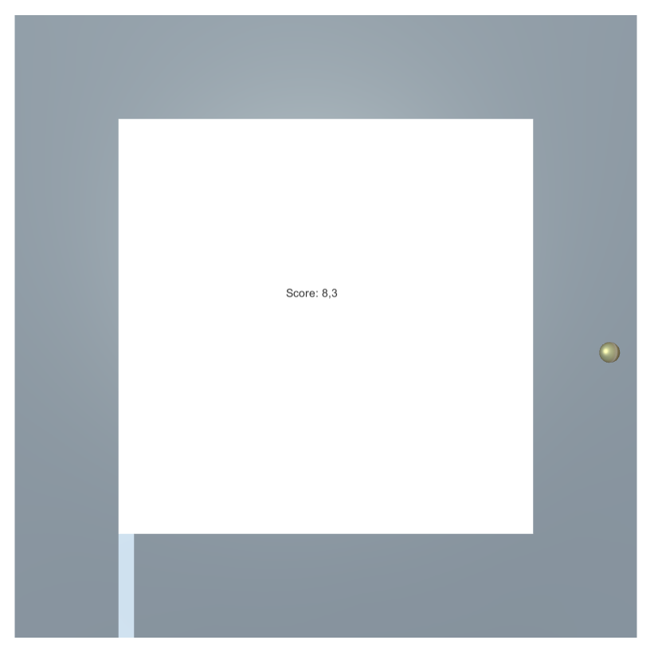

# UnityReinforcementLearning
Master's Thesis repository preparation: getting to understand the Unity Machine Learning Agents workflows.

## Non-AI scenes 

 
### Dummy Melon
3D Circuit. Dead if fallen. Scenario for starting the training. 

  

## Random Path Generation
### Random Trajectory Generation
Prototyping Polar Functions for the random path generation. 

  

