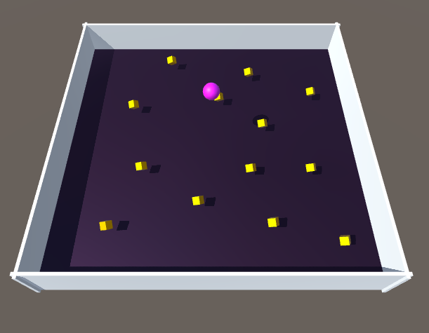
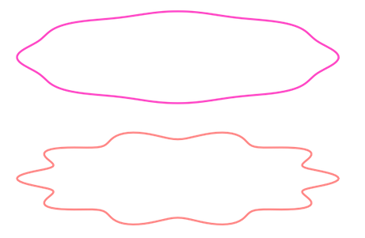

# UnityReinforcementLearning
Master's Thesis repository preparation: getting to understand the Unity Machine Learning Agents workflows.

## Non-AI scenes 

### Eppur-Muove 3D
Simple 3D rolling ball set up. 

  

 
### Random Trajectory Generation
Prototyping Polar Functions for the random path generation. 

  

